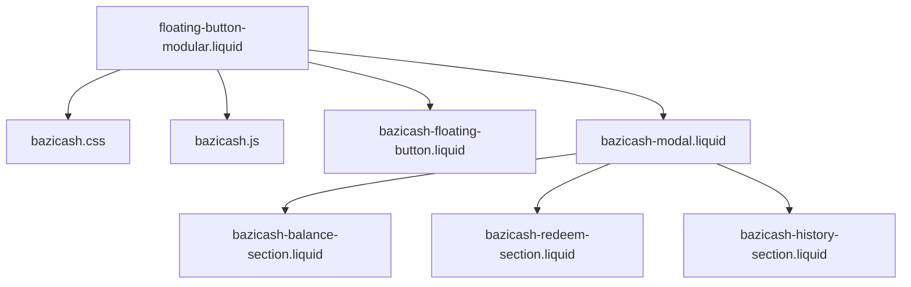

# 🚀 Documentação Técnica - Sistema de Floating Button

## 📋 Índice
- [Visão Geral](#-visão-geral)
- [Arquitetura](#-arquitetura)
- [Implementação](#-implementação)
- [Monitoramento e Manutenção](#-monitoramento-e-manutenção)
- [Troubleshooting](#-troubleshooting)
- [Changelog](#-changelog)

---

## 🎯 Visão Geral

O **Sistema de Floating Button** é uma implementação modular de cashback (BaziCash) para e-commerce Shopify, projetado para alta performance, fácil manutenção e experiência de usuário excepcional.

### **Características Principais:**
- ✅ **Modular**: Componentes separados e reutilizáveis
- ✅ **Responsivo**: Funciona perfeitamente em desktop e mobile
- ✅ **Performático**: CSS/JS otimizados e cacheados
- ✅ **Acessível**: Compatível com screen readers e navegação por teclado
- ✅ **Maintível**: Código organizado e bem documentado

---

## 🏗️ Arquitetura

### **Diagrama de Componentes:**



### **Separação de Responsabilidades:**

| **Camada** | **Arquivo** | **Responsabilidade** |
|------------|-------------|---------------------|
| **Apresentação** | `*.liquid` | HTML e estrutura |
| **Estilo** | `bazicash.css` | Visual e layout |
| **Comportamento** | `bazicash.js` | Lógica e interações |
| **Configuração** | `schema` | Configurações do admin |

---

## 🛠️ Implementação

### **1. Instalação**

```liquid
<!-- Adicionar no tema -->

```

### **2. Estrutura de Arquivos**

```
📁 theme/
├── 🎨 assets/
│   ├── bazicash.css              # Estilos principais
│   └── bazicash.js               # Lógica do sistema
├── 🧩 snippets/
│   ├── bazicash-modal.liquid           # Container principal
│   ├── bazicash-floating-button.liquid # Botão flutuante
│   ├── bazicash-balance-section.liquid # Seção de saldo
│   ├── bazicash-redeem-section.liquid  # Seção de resgate
│   └── bazicash-history-section.liquid # Histórico transações
├── 📄 sections/
│   └── floating-button-modular.liquid  # Orquestrador principal
└── 📚 docs/
    └── FLOATING-BUTTON-DOCS.md        # Esta documentação
```

### **3. Configuração no Admin**

Acesse: **Admin Shopify > Online Store > Themes > Customize**

**Configurações disponíveis:**
- ✅ **Texto do botão**: Personalização interna
- ✅ **Modo demonstração**: Para testes sem login
- ✅ **Configurações avançadas**: Futuras expansões

---

## 🔧 Monitoramento e Manutenção

### **📊 Arquivos para Monitoramento**

#### **🎯 Críticos (Monitoramento Diário)**

| **Arquivo** | **Prioridade** | **Motivo** | **Sinais de Alerta** |
|-------------|----------------|------------|---------------------|
| `assets/bazicash.js` | 🔴 **ALTA** | Lógica core do sistema | Erros no console, API failures |
| `sections/floating-button-modular.liquid` | 🔴 **ALTA** | Entry point principal | Schema inválido, não renderiza |
| `assets/bazicash.css` | 🟡 **MÉDIA** | Interface visual | Layout quebrado, responsividade |

#### **🔍 Secundários (Monitoramento Semanal)**

| **Arquivo** | **Prioridade** | **Motivo** | **Verificações** |
|-------------|----------------|------------|------------------|
| `snippets/bazicash-modal.liquid` | 🟡 **MÉDIA** | Container do modal | Modal não abre, estrutura |
| `snippets/bazicash-balance-section.liquid` | 🟡 **MÉDIA** | Exibição de saldo | Valores incorretos, layout stats |
| `snippets/bazicash-redeem-section.liquid` | 🟡 **MÉDIA** | Funcionalidade resgate | Formulário, validações |
| `snippets/bazicash-history-section.liquid` | 🟢 **BAIXA** | Histórico transações | Filtros, paginação |
| `snippets/bazicash-floating-button.liquid` | 🟢 **BAIXA** | Botão visual | Badge, animações |

### **📈 Métricas de Saúde**

#### **Performance:**
```javascript
// Verificar no console do browser
console.time('BaziCash-Load');
// ... após carregamento
console.timeEnd('BaziCash-Load'); // < 500ms esperado
```

#### **Funcionalidade:**
- ✅ Botão flutuante visível
- ✅ Modal abre/fecha corretamente
- ✅ Saldo carrega (modo demo)
- ✅ Histórico filtra por abas
- ✅ Formulário resgate funciona
- ✅ Responsividade mobile

#### **Erros Comuns:**
```bash
# Logs para monitorar
- "BaziCash is not defined"
- "bazicashModal not found"
- "CSS not loading"
- "Schema validation failed"
```

### **🚨 Sistema de Alertas**

#### **Nível 1 - Crítico (Ação Imediata):**
- 🚫 JavaScript quebrado
- 🚫 CSS não carrega
- 🚫 Modal não abre
- 🚫 Botão não aparece

#### **Nível 2 - Importante (Ação em 24h):**
- ⚠️ Problemas mobile
- ⚠️ Animações travadas
- ⚠️ Badge não atualiza
- ⚠️ Estatísticas incorretas

#### **Nível 3 - Menor (Ação em 72h):**
- 💡 Melhorias de UX
- 💡 Otimizações performance
- 💡 Atualizações visuais
- 💡 Novos recursos

### **📋 Checklist de Manutenção**

#### **🗓️ Diário:**
- [ ] Verificar console errors
- [ ] Testar funcionalidade básica
- [ ] Monitorar performance loading

#### **📅 Semanal:**
- [ ] Testar todos os componentes
- [ ] Verificar responsividade
- [ ] Validar dados mockados
- [ ] Revisar logs de erro

#### **📆 Mensal:**
- [ ] Audit completo código
- [ ] Testes cross-browser
- [ ] Otimizações performance
- [ ] Update documentação

#### **🔄 Trimestral:**
- [ ] Refatoração necessária
- [ ] Upgrade dependências
- [ ] Análise métricas uso
- [ ] Planejamento features

---

## 🐛 Troubleshooting

### **Problemas Comuns e Soluções:**

#### **1. Botão não aparece**
```liquid
<!-- Verificar se está ativo no schema -->

  <!-- Botão deveria aparecer aqui -->

```
**Solução:** Ativar nas configurações do tema

#### **2. CSS não carrega**
```html
<!-- Verificar se o link está correto -->
{{ 'bazicash.css' | asset_url | stylesheet_tag }}
```
**Solução:** Verificar se arquivo existe em `/assets/`

#### **3. JavaScript com erro**
```javascript
// Verificar se namespace está definido
if (typeof BaziCash !== 'undefined') {
  BaziCash.init();
}
```
**Solução:** Verificar sintaxe e dependências

#### **4. Modal não abre**
```javascript
// Debug modal
console.log(document.getElementById('bazicashModal'));
```
**Solução:** Verificar se ID existe e não há conflitos CSS

#### **5. Dados não carregam**
```javascript
// Verificar dados mockados
console.log(BaziCash.MOCK_DATA);
```
**Solução:** Validar estrutura dos dados

### **🔍 Debug Tools:**

#### **Browser DevTools:**
```javascript
// Console Commands úteis
BaziCash.loadBalance();          // Recarregar saldo
BaziCash.loadHistory();          // Recarregar histórico
BaziCash.updateStats();          // Atualizar estatísticas
BaziCash.MOCK_DATA;              // Ver dados mockados
```

#### **Network Monitoring:**
- Verificar carregamento assets
- Monitorar requests API (futuras)
- Validar cache headers

---

## 📝 Changelog

### **v2.0.0 - Refatoração Modular** (25/09/2024)
- ✅ **BREAKING:** Separação completa em arquivos modulares
- ✅ **NEW:** Sistema de cores branded
- ✅ **NEW:** Micro-interações e animações
- ✅ **NEW:** Estatísticas em tempo real
- ✅ **NEW:** Badge dinâmico no botão
- ✅ **IMPROVE:** Performance otimizada
- ✅ **IMPROVE:** Responsividade mobile

### **v1.0.0 - Versão Inicial** (Anterior)
- ✅ Implementação monolítica (1145 linhas)
- ✅ Funcionalidade básica BaziCash
- ✅ Modal com histórico
- ✅ Sistema de resgate

---

## 🤝 Contribuição

### **Para desenvolvedores:**

#### **1. Setup do ambiente:**
```bash
# Clone do tema
git clone [repo-url]
cd theme-directory

# Instalar Shopify CLI
npm install -g @shopify/cli @shopify/theme
```

#### **2. Desenvolvimento:**
```bash
# Modo desenvolvimento
shopify theme dev

# Deploy
shopify theme push
```

#### **3. Padrões de código:**
- **CSS:** BEM methodology
- **JS:** ES6+ com namespace
- **Liquid:** Comentários descritivos
- **Commits:** Conventional commits

#### **4. Testing:**
- ✅ Cross-browser testing
- ✅ Mobile responsiveness
- ✅ Performance audit
- ✅ Accessibility check

---

## 📞 Suporte

### **Para emergências:**
1. **Desativar temporariamente:** Remover seção do tema
2. **Rollback:** Reverter para commit anterior
3. **Modo seguro:** Usar versão backup

### **Contatos:**
- **Tech Lead:** [Nome do responsável]
- **DevOps:** [Nome do responsável]
- **QA:** [Nome do responsável]

---

**📄 Documento criado em:** 25/09/2024
**🔄 Última atualização:** 25/09/2024
**👤 Autor:** Equipe de Desenvolvimento
**📝 Versão:** 2.0.0